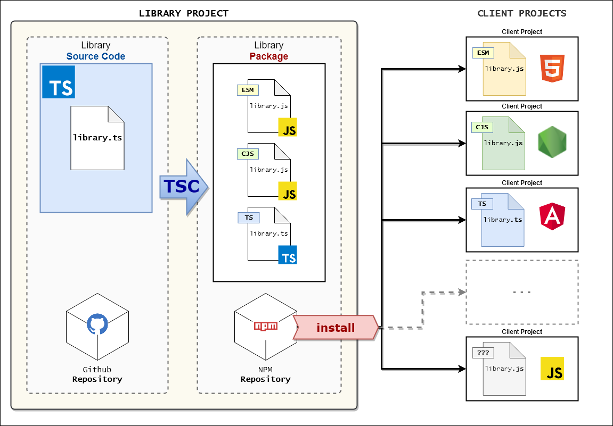

# One Typescript for all

This is a PoC demonstrating a "*single source*" Typescript library project generating automatically multiple versions of the script (CJS, ESM, TS) and a sample CLI: **ONE-FOR-ALL**

<h2>Table-of-Content</h2>

<!-- @import "[TOC]" {cmd="toc" depthFrom=2 depthTo=6 orderedList=false} -->

<!-- code_chunk_output -->

- [Overview](#overview)
- [Objectives](#objectives)
  - [SINGLE TYPESCRIPT INPUT &rightarrow; MULTIPLE OUTPUT](#single-typescript-input-rightarrow-multiple-output)
  - [RUN ESM LIBRARIES IN THE BROWSER](#run-esm-libraries-in-the-browser)
- [Requirements](#requirements)
- [Project Development versus Package Publication](#project-development-versus-package-publication)
- [How to implement "one-for-all"?](#how-to-implement-one-for-all)
  - [Sources](#sources)
  - [Typescript compiler (TSC) configuration](#typescript-compiler-tsc-configuration)
  - [*.gitignore* file](#gitignore-file)
  - [npm scripts](#npm-scripts)
  - [The `package.json` targets](#the-packagejson-targets)
  - [Important !](#important)
- [Project documentation](#project-documentation)

<!-- /code_chunk_output -->

## Overview



## Objectives

### SINGLE TYPESCRIPT INPUT &rightarrow; MULTIPLE OUTPUT

This is the main objective: **ONE-FOR-ALL**!

- <u>**Implement**</u> a library using **Typescript exclusively**.
- <u>**Use**</u> the library with any client which is able to use/run **CommonJS, ECMAScript or Typescript modules**.

### RUN ESM LIBRARIES IN THE BROWSER

A *browser app/client* may use the *ESM library* directly. In this case, a **modern browser** is required.
**This use case is demonstrated in this PoC**.

Older browser would require to adapt the scripts before integration, using a supplemental "transpiler" to output compatible scripts - hence requiring a further implementation step. Such **older browsers aren't in the focus of this project**.

## Requirements

**Node.js** and **NPM** (or **yarn**) should be "globally" installed on your system to ease the installation of the packages and/or source files.
Preferably:

- node: >=13.x
- npm: >=6.x

**Typescript** may be globally present as well, thus is not required, since the PoC will use its own (local) version:

- tsc: >=3.9.5 (earlier version like 3.8.x should be ok - not tested, though)

## Project Development versus Package Publication

The PoC is configured (`package.json` and `.gitignore`) to separate development and usage of the lib/app: "GitHub" versus "NPM".

1. The bare **sources** (typescript only)  of the library and application are stored in the <u>**Github Repository**</u>.
  use this if you'd like to **develop**, adapt etc. the library/application

1. The **transpiled** i.e. usable library artifact (ESM, CommonJS, Typescript and `*.d.ts` types declaration files ) is stored in the <u>**NPM repository**</u> - though without the source files.  
  use this if you'd like to **use** the library/application in your project.

This separation is intended:

- to <u>reduce the size</u> of the published package to the min possible and
- to <u>**clearly separate the different concerns**</u>.

**Note**: the artifacts i.e the files could be minified and thus reduce the size of the package furthermore. This is not implemented here, though.

## How to implement "one-for-all"?

This section summarize the techniques i.e. engineering procedures used to realize the "one-for-all" objective.

### Sources

The sources files are all contained in the `src` folder. No exception.

### Typescript compiler (TSC) configuration

The output (multiple modules i.e. CJS, ESM...) of **TSC** is driven by the different `tsconfig.*.json`files and by the `package.json` file:

1. There's *intentionally NO default* `tsconfig.json` file in this project! Instead, builds are created on purpose i.e specifically through targeting a **specific tsconfig**.
1. The `tsconfig.common.json` is declaring the configuration shared by all targets. Hence, it correspond to a traditional tsconfig.json, though rename on purpose (see above).
1. The `tsconfig.bin.json` is targeting the generation/output of the **CLI application** in the `bin` folder.
1. The `tsconfig.esm.json` is targeting the generation/output of the **ESM scripts** version in the `lib/esm/` folder.
1. The `tsconfig.cjs.json` is targeting the generation/output of the **ESM scripts** version in the `lib/esm/` folder.
1. The `tsconfig.types.json` is generating the types declaration `*.d.ts` files for the **Typescript scripts** version in the `lib/ts/` folder. This is required to provide those files in the npm package.

### *.gitignore* file

Since the source code repository should NOT contain the "*output*" of the compilation/distribution, the `.gitignore` file excludes the corresponding folders: `/lib` and `/bin`.

### npm scripts

In order to generate the output i.e to produce the different artifacts (ESJ, ESM, CLI and TS) to be **published in a NPM repository** easily, the `package.json` defines some npm scripts.
Those scripts can be executed using:

```shell
> npm run <name-of-the-script>
```

The most important npm scripts of the project are described below:

```json
{
  "scripts": {

    // ===== EXECUTE CLI =============================

    // RUN the CLI application using TS-NODE (no artifact is generated)
    "start": "ts-node --project tsconfig.common.json src/application.ts -d",

    // START the COMPILED CLI application (prior build is required)
    "node": "node bin/application.js",

    // ===== BUILD ARTIFACTS ========================

    // BUILD the single artifacts
    "build:bin": "tsc -p tsconfig.bin.json",
    "build:cjs": "tsc -p tsconfig.cjs.json",
    "build:esm": "tsc -p tsconfig.esm.json",
    "build:types": "tsc -p tsconfig.types.json",

    // BUILD ALL artifacts at once
    "build": "npm run build:types && npm run build:bin && npm run build:cjs && npm run build:esm",

    // ===== PACKAGE PUBLICATION======================

    // PREPARE and GENERATE all artifacts for publishing usage
    "prod": "npm run cleanup && npm run build && npm run copyts && npm run test:prod",

    // check the content of the NPM package i.e. the list of artifacts that should be published
    "checkpkg": "pkgfiles",

    // Pre-publishing (this script will be executed by NPM automatically when publishing)
    "prepublishOnly": "npm run prod",

    // ===== DEVELOPMENT ONLY ========================

    // generate the artifacts and link the project in the local npm repository
    "local:publish": "npm run prod && npm link",
    // undo the local npm repository link
    "local:unpublish": "npm unlink && npm run cleanup:nodemodules && npm install",

    // ===== HELPERS =================================

    // delete the folders containing the published artifacts
    "cleanup": "rimraf ./lib ./bin ./coverage",
    // delete the node_modules folder (e.g. when un-linking the project to local npm repository)
    "cleanup:nodemodules": "npx rimraf ./node_modules",
    // copy the Typescript artifacts to be published in the npm package
    "copyts": "copyfiles -u 2 src/lib/**/* -e **/*.spec.ts lib/ts"
  }
}
```

Note: Using this configuration allows to publish the library on NPM without hassle. Just call `> npm publish`! The configured npm scripts will do the rest.

### The `package.json` targets

Once the artifacts are produced and published, a client project intending to use the library package will operate a lookup in the package definition to **find and use an appropriate library artifact**:

this automatic lookup is using the following **fields** (if available) as defined in the `package.sjon` file:

```json
{
  // This define the DEFAULT artifact of the package. Here: the TYPESCRIPT version
  "main": "lib/ts/library.ts",

  // Tells the client project where the type declarations are located
  "types": "lib/ts/library.d.ts",

  // Locate the main ESM artifact for an ESM capable environment (e.g. node >= v13.* if configured approprietly)
  "module": "lib/esm/library.js",

  // Locate the main ESM artifact for Browser environment...
  "browser": "lib/esm/library.js",

  // This location is NOT standard, thus included here for documentation purposes.
  // The value could be used in place of the "main" defined above = to publish a CJS-BY-DEFAULT package
  "node": "lib/cjs/library.js",

  // Locate the CLI app artifact. Used when installing the package to register the CLI on the system (localy or globaly). The CLI executable is registered as "ts4all" here.
  "bin": {
    "ts4all": "bin/application.js"
  },
}
```

**Notes**: The PoC package is defining the "Typescript artifact" as the **default**. Instead, the "CJS artifact" could have been declared as default through the key-value `"main": "lib/cjs/library.js"`.

### Important !

The `"main"`, `"module"` and `"browser"` keys specified in the library (i.e. in the `package.json` of the library) <u>do impact the binding of the library</u> in any client project: the configuration in the library entails the suitable usage of the `import ... from ...;` and `... = require(...);` statements (including suitable paths) in the client projects!

Thus, it is recommended to *never change this specification after the library package has been published*. Otherwise, a "**BREAKING CHANGE**" should be commited and a major version released!
(See [BREAKING CHANGES in commits][commitguideline])

## Project documentation

- [Sample Client Applications][samples]
- [commit guideline][commitguideline]
- [project development][development]

[samples]: examples/README.md
[commitguideline]: doc/commit-messages-guideline.md
[development]: doc/development.md
