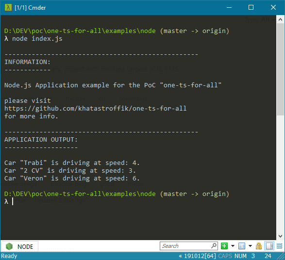
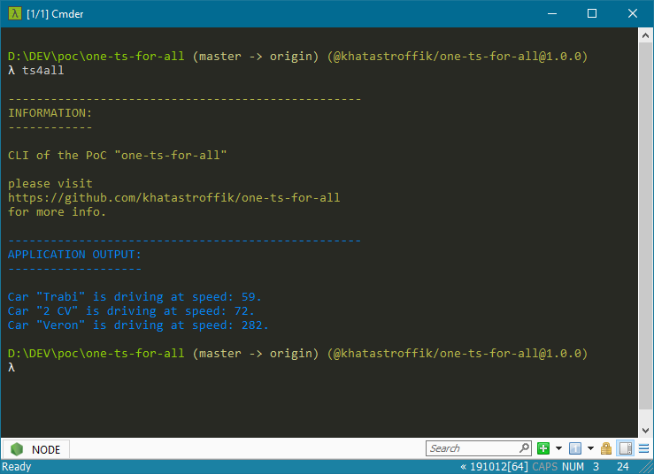
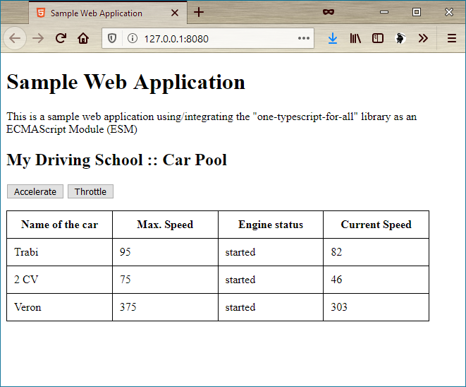

# Sample Client Applications

back to [main project page][mainpage]

The library implemented in the PoC (see [**src**][src] folder) and deployed as a [NPM package][npmp] can be used in different ways by any/multiple client projects.

See the list of **provided example applications** below.

<h2>Table-of-Content</h2>

<!-- @import "[TOC]" {cmd="toc" depthFrom=2 depthTo=6 orderedList=false} -->

<!-- code_chunk_output -->

- [Screenshots](#screenshots)
- [Installation](#installation)
  - [standard installation](#standard-installation)
  - [alternative installation](#alternative-installation)
- [Use Cases](#use-cases)
  - [Usage as a CommonJS module in a node project](#usage-as-a-ucommonjsu-module-in-a-node-project)
  - [Usage as EcmaScript* module in a web application](#usage-as-uecmascriptu-module-in-a-web-application)
  - [Usage as Typescript module in an Angular (Typescript) application](#usage-as-utypescriptu-module-in-an-angular-typescript-application)

<!-- /code_chunk_output -->

## Screenshots

- **Node** Preview:  

- **CLI** Preview:

- **Browser** Preview:

- **Angular** Preview:


## Installation

### standard installation

In most of the case, the client project needs to install the [NPM package][npmp] as a dependency.

The *one-ts-for-all* should be integrated in the client project to augment its functionality, hence it should be installed as a *productive* dependency, hence:

```shell
npm install --save @khatastroffik/one-ts-for-all
```

Note: In a real scenario, you'd replace the name of the installed package above with the adequate name for the library of your choice.

### alternative installation

Alternatively, the client project could download the library from a Source-Code Repository (e.g. use the present repository [download file](https://github.com/khatastroffik/one-ts-for-all/archive/master.zip)) and manually link/integrate the library files in the client project wherever needed. Cloning the library and installing the cloned repository locally is also a possible alternative.

These **'loose" installation procedures aren't recommanded**, though! Hence, they're not documented in detail here.

## Use Cases

### Usage as a <u>CommonJS</u> module in a node project

goto ['NodeJS' Sample Project](./node/README.md)

### Usage as <u>EcmaScript*</u> module in a web application

goto ['Browser' Sample Project](./browser/README.md)

### Usage as <u>Typescript</u> module in an Angular (Typescript) application

goto ['Angular' Sample Project](./angular/README.md)

[mainpage]: ../README.md
[src]: ../src
[npmp]: https://www.npmjs.com/package/@khatastroffik/one-ts-for-all
